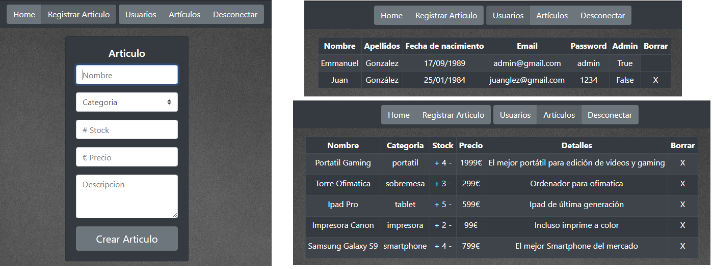

# **Online Shop**

Online store 🛍️ of technology items 💻 📱 🖨️

## **Table of contents**

- [**Online Shop**](#online-shop)
  - [**Table of contents**](#table-of-contents)
  - [**General info**](#general-info)
  - [**Demo**](#demo)
  - [**Screenshots**](#screenshots)
  - [**Technologies**](#technologies)
  - [**Setup**](#setup)
  - [**Usage**](#usage)
  - [**Status**](#status)
  - [**Contact**](#contact)

## **General info**

**Date**: January, 2020.  
**Duration**: 1 Week.

It was a deliverable practice of creating a Web Application with **ASP.NET MVC5**, So I have developed an online store of technology items which users register to buy products while the admin user is the one who manages the website and can modify the products and users through the administrator panel.

## **Demo**

Unfortunately the project does not have an interactive demo that you can try, since it is not deployed on the internet, only if you download the project following the setup steps.

> <br><i>Demo</i>

## **Screenshots**

> 
> 
> <br><i>Example of the 3 user zones</i>

## **Technologies**

- **HTML**
- **CSS**
- **Razor**&nbsp;&nbsp;_(Views)_
- [**Bootstrap 4**](https://getbootstrap.com/docs/4.1)
- **C#**
- **ASP.NET MVC5**
- **Entity Framework / SQL**&nbsp;&nbsp;_(BBDD)_

## **Setup**

1. Clone or download the repository.

```console
git clone https://github.com/udsgit/online-shop.git
```

2. Open project with **Visual Studio** (In my case I used the Community 2019 version).
3. Done, you can run it from there.

## **Usage**

1. You can run it from **Visual Studio** when you compile the project.
2. When you run it, you would be in guest mode being able to log in if you already have an account or register a new account.
3. If you have already logged in with a normal account, you will be able to access the user panel in which you can buy in the store.
4. And finally, if you log in with the admin user, which is **admin@gmail.com** with pass **admin** you will enter the administrator panel to manage the web, being able to add new articles, modify stock and delete users.

## **Status**

Project is: **_Completed._**

Because the idea of the project was to create an online store where you could register, log in and buy, being able to differentiate the types of users. Obviously it would not be a real online store, since it was a project to practice this language.

## **Contact**

Created by [@Emmanuel](https://www.linkedin.com/in/emagleza/), feel free to contact me!
